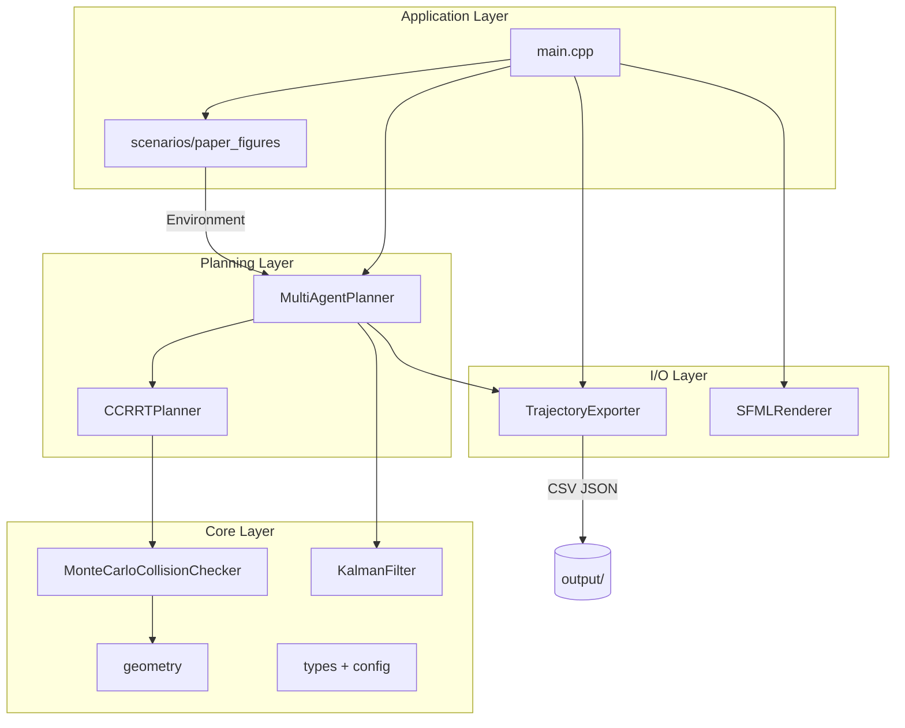
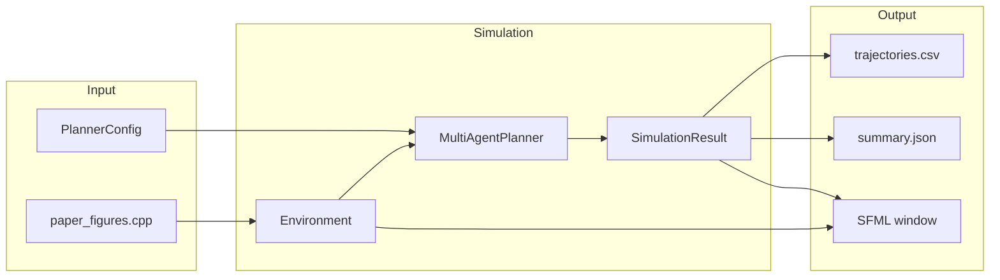
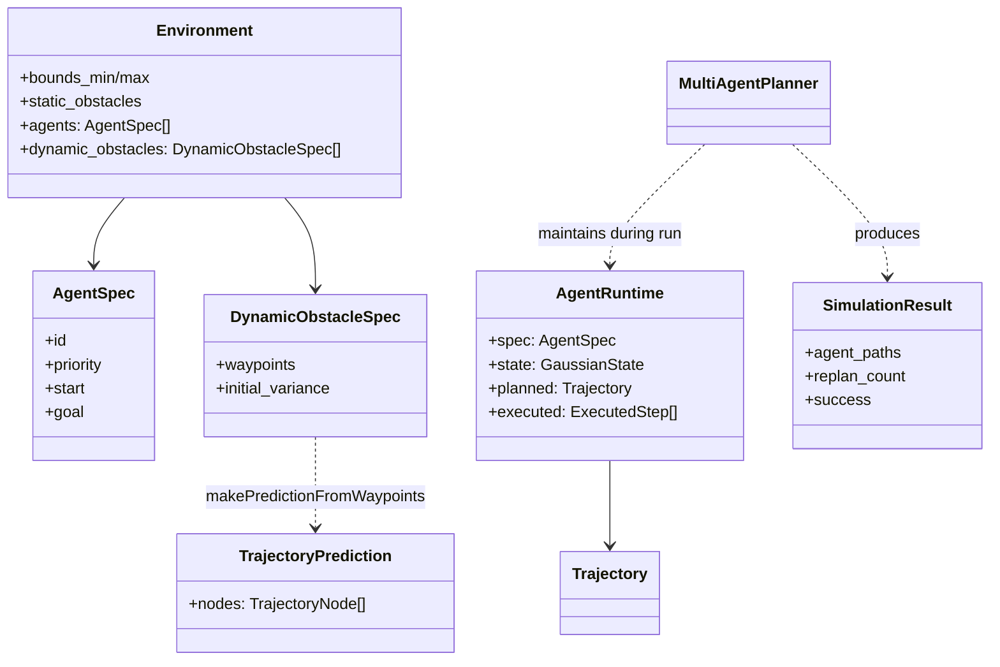
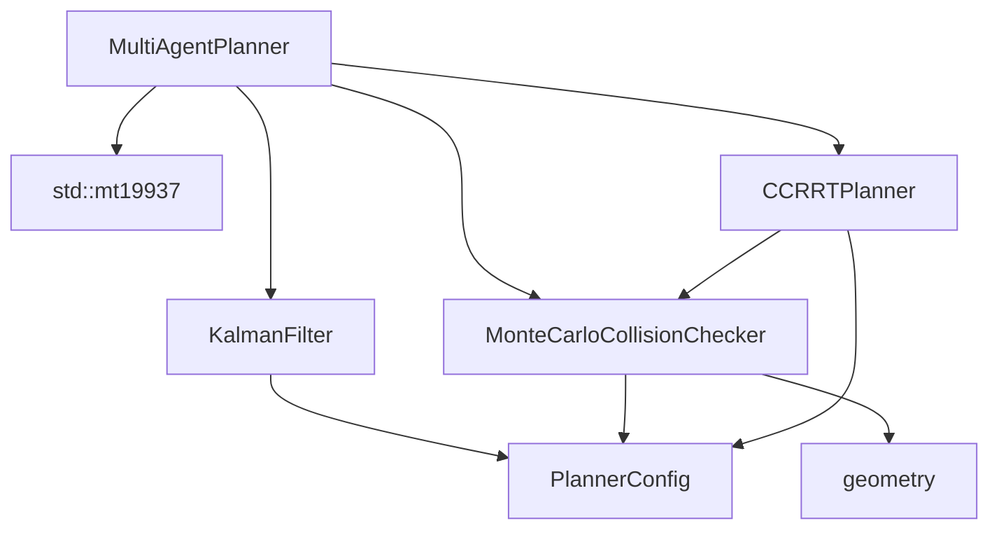
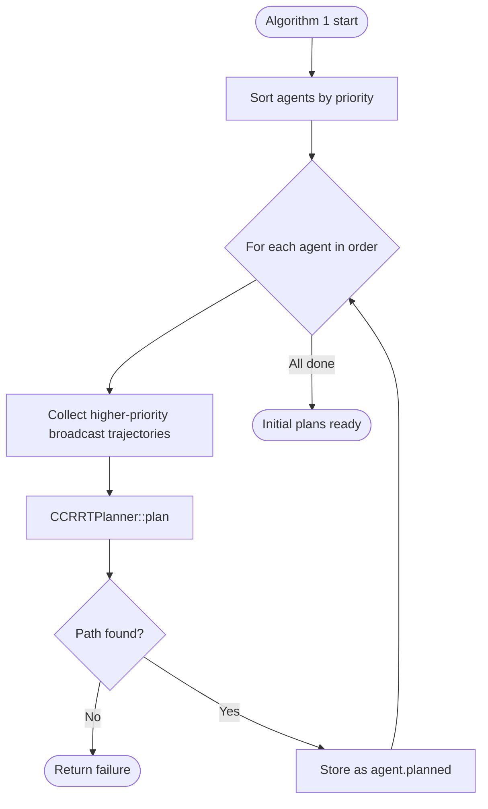
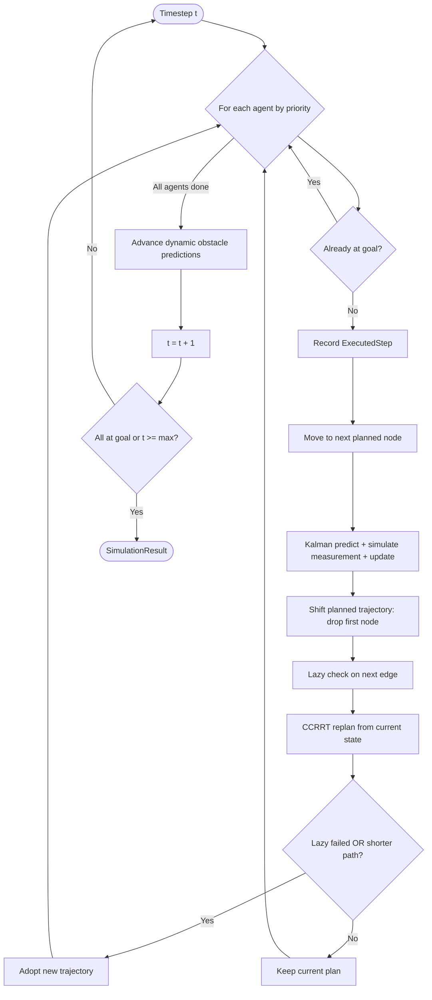
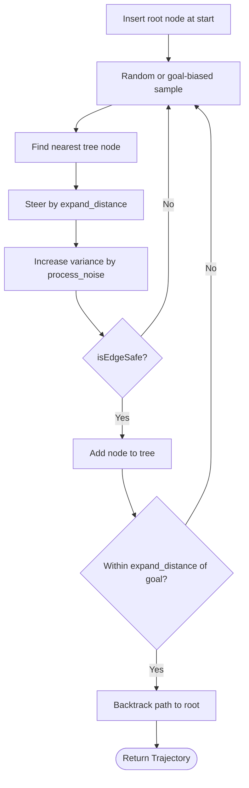
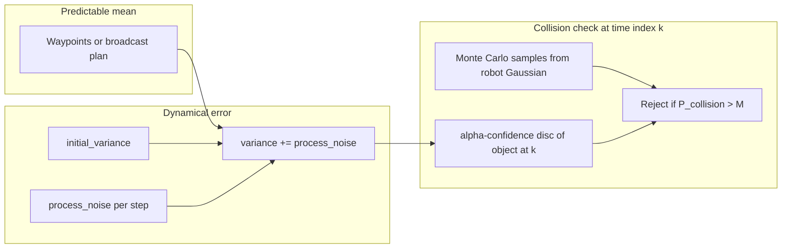
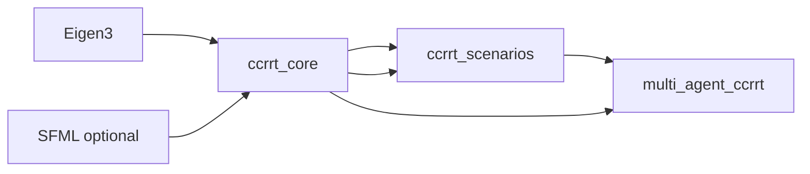

# Architecture — Multi-Agent CC-RRT

This document describes how the C++ implementation is structured, how data flows through the system, and how the code maps to the DSCC 2019 paper.

**Paper:** [On Receding Horizon Chance Constraint Motion Planning for Uncertain Multi-Agent Systems](https://doi.org/10.1115/DSCC2019-9237)

---

## High-level layers

The codebase is organized into four layers. Dependencies point downward only (application → planning → core → I/O).



| Layer | Directory | Responsibility |
|-------|-----------|----------------|
| Application | `main.cpp`, `scenarios/`, `config/` | CLI, JSON config, scenario selection |
| Planning | `multi_agent_planner.*`, `ccrrt_planner.*` | Algorithms 1 & 2, RRT tree growth |
| Core | `collision_checker.*`, `kalman_filter.*`, `geometry.*`, `types.hpp`, `config.hpp` | Math, uncertainty, chance constraints |
| I/O | `trajectory_exporter.*`, `sfml_renderer.*` | File export and optional visualization |

---

## End-to-end data flow

From scenario definition to exported trajectories:



### Step-by-step

1. **`main.cpp`** parses CLI flags (`--scenario`, `--seed`, `--mc-samples`, …) and builds a `PlannerConfig`.
2. **`allScenarios()`** returns a named `Environment`: static obstacles, agent specs, dynamic obstacle waypoints.
3. **`MultiAgentPlanner::run(environment, name)`** executes the full simulation and returns a `SimulationResult`.
4. **`TrajectoryExporter`** writes `trajectories.csv` and `summary.json` under `output/<scenario>/`.
5. **`SFMLRenderer`** (optional) displays the environment and executed paths.

---

## Core data types

How the main structs relate:



| Type | Role |
|------|------|
| `Environment` | Immutable world description passed into `run()` |
| `AgentSpec` | Static agent definition (start, goal, priority) |
| `DynamicObstacleSpec` | Known mean waypoints; variance added at runtime |
| `GaussianState` | Mean position + isotropic variance for one agent |
| `Trajectory` | Planned path (nodes with growing variance) |
| `TrajectoryPrediction` | Broadcast prediction used by other agents for collision checks |
| `AgentRuntime` | Live agent state during simulation |
| `ExecutedStep` | One recorded timestep for export |
| `SimulationResult` | Final output bundle |

---

## MultiAgentPlanner internals

`MultiAgentPlanner` owns and wires together the sub-components:



Construction order matters: `collision_checker_` holds a reference to `rng_`, and `planner_` holds a reference to `collision_checker_`.

---

## Algorithm 1 — Initial planning

Priority-ordered CC-RRT for each agent before execution begins.



For agent *i*, `collectAgentPredictions(agents, i.id)` gathers the planned trajectories of all agents that already planned (higher priority). Lower-priority agents treat those as moving obstacles with uncertainty.

---

## Algorithm 2 — Receding horizon loop

Executed each global timestep until all agents reach their goals.



**Lazy check** (Section 4.2.1): re-evaluates collision probability on the immediate next edge against all other agents and dynamic obstacles. Forces replanning even when the cost function would prefer keeping an unsafe path.

---

## Single-agent CC-RRT loop

Inside `CCRRTPlanner::plan()`:



Tree depth from the root determines the prediction horizon index when checking against moving objects' `TrajectoryPrediction` nodes.

---

## Uncertainty and collision model

All moving entities (other agents and dynamic obstacles) share the same representation:



| Object type | Mean trajectory | Uncertainty |
|-------------|-----------------|-------------|
| Static obstacle | Fixed center | None (hard disc) |
| Other agent | `agent.planned` broadcast | Variance per node |
| Dynamic obstacle | `DynamicObstacleSpec.waypoints` | `makePredictionFromWaypoints()` |
| Ego agent | RRT tree node | Grows from root; shrinks on Kalman update |

**Static obstacles:** sample inside disc ⇒ collision.

**Moving objects:** sample inside the other object's α-confidence disc ⇒ collision (paper α = 0.99).

**Edges:** additionally rejected if they geometrically intersect a broadcast path segment or a static obstacle disc.

---

## File map

```
cpp/
├── main.cpp                          CLI entry point
├── ARCHITECTURE.md                   This document
├── Doxyfile                          API doc generator
├── include/ccrrt/
│   ├── ccrrt.hpp                     Umbrella include
│   ├── config.hpp                    PlannerConfig defaults
│   ├── types.hpp                     Vec2, Environment, Trajectory, …
│   ├── geometry.hpp                  Distance, intersection, chi-squared
│   ├── kalman_filter.hpp             Predict / update / simulate GPS
│   ├── collision_checker.hpp         ICollisionChecker + Monte Carlo impl
│   ├── ccrrt_planner.hpp             Single-agent CC-RRT
│   ├── multi_agent_planner.hpp       Algorithms 1 & 2 coordinator
│   ├── trajectory_exporter.hpp       CSV / JSON export
│   ├── runtime_config.hpp            JSON config loader
│   ├── legacy_collision_checker.hpp  Python-style deterministic checks
│   └── sfml_renderer.hpp             Optional visualization
├── src/                              Implementations (mirror headers)
├── config/
│   ├── ccrrt.json                    Runtime parameters (no rebuild)
│   └── python_compat.json            Python prototype preset
└── scenarios/
    ├── paper_figures.cpp             figure5, figure6, figure7
    └── python_reference.cpp          Multiagent CCRRT.py test case
```

---

## Extension points

The design supports future work without rewriting the core:

| Extension | How |
|-----------|-----|
| New scenarios | Add a factory in `scenarios/`, register in `allScenarios()`, **or** define in `config/ccrrt.json` |
| Tune parameters without rebuild | Edit `config/ccrrt.json` (see **CONFIG.md**) |
| Preview scenarios without sim | `multi_agent_ccrrt --scenario figure5 --preview` (requires SFML) |
| Different collision model | Implement `ICollisionChecker`; select via `use_legacy_collision` in config |
| Python prototype parity | `--python-compat` or `config/python_compat.json` + `python_reference` scenario |
| RRT* / Dubins-RRT | Replace or wrap `CCRRTPlanner` behind a common interface |
| ROS 2 wrapper | Thin node that fills `Environment` from topics and calls `MultiAgentPlanner::run()` |
| Unit tests | Test `geometry`, `KalmanFilter`, and `MonteCarloCollisionChecker` in isolation with fixed RNG seeds |

---

## CMake targets



| Target | Contents |
|--------|----------|
| `ccrrt_core` | All `src/*.cpp` except scenarios |
| `ccrrt_scenarios` | `scenarios/paper_figures.cpp` |
| `multi_agent_ccrrt` | `main.cpp` executable |

---

## Paper mapping

| Paper section | Code |
|---------------|------|
| Section 2.2 — CC-RRT | `CCRRTPlanner` |
| Section 3.2 — Sensing / Eq. 5–7 | `KalmanFilter`, variance growth in tree and predictions |
| Section 3.2 — Monte Carlo collision | `MonteCarloCollisionChecker` |
| Algorithm 1 — Priority multi-agent CC-RRT | `MultiAgentPlanner::planInitialTrajectories` |
| Algorithm 2 — Receding horizon | `MultiAgentPlanner::run` loop |
| Section 4.2.1 — Lazy check | `MultiAgentPlanner::lazyCheck` |
| Section 5 — Simulations | `scenarios/paper_figures.cpp` |
