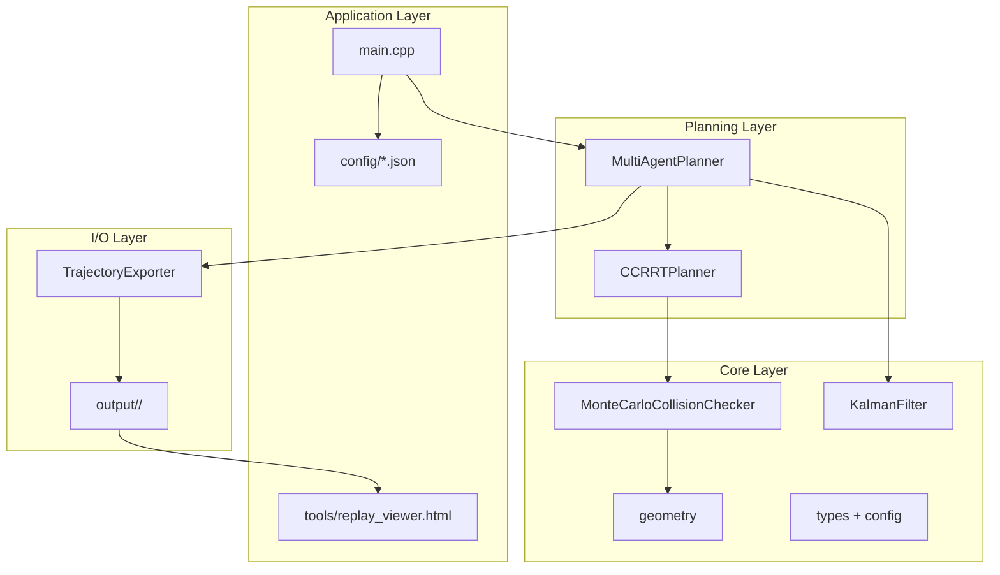
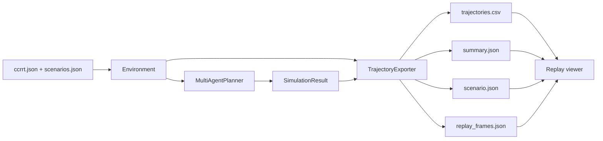

# Architecture - Multi-Agent CC-RRT

This document summarizes how the C++ implementation is structured, how data flows through the system, and how the code maps to the DSCC 2019 paper.

**Paper:** [On Receding Horizon Chance Constraint Motion Planning for Uncertain Multi-Agent Systems](https://doi.org/10.1115/DSCC2019-9237)

## Layers

| Layer | Directory | Responsibility |
|-------|-----------|----------------|
| Application | `main.cpp`, `config/`, `tools/` | CLI, JSON config, replay viewing |
| Planning | `multi_agent_planner.*`, `ccrrt_planner.*` | Algorithms 1 and 2, RRT tree growth |
| Core | `collision_checker.*`, `kalman_filter.*`, `geometry.*`, `types.hpp`, `config.hpp` | Math, uncertainty, chance constraints |
| I/O | `trajectory_exporter.*` | Replay export as CSV/JSON |

## Data Flow

1. `main.cpp` loads run settings, planner parameters, and scenario geometry from JSON.
2. `ScenarioRegistry` selects a named scenario.
3. `MultiAgentPlanner::run(environment, name)` executes priority planning and receding-horizon replanning while optional observers receive per-timestep frames.
4. `TrajectoryExporter` writes `trajectories.csv`, `summary.json`, `scenario.json`, and `replay_frames.json`.
5. `tools/replay_viewer.html` loads the output folder in a browser and visualizes the run with the canvas, per-agent panel, and summary panel.

## Core Data Types

| Type | Role |
|------|------|
| `Environment` | Immutable world description passed into `run()` |
| `AgentSpec` | Static agent definition: id, priority, start, goal |
| `DynamicObstacleSpec` | Known mean waypoints and optional variance schedule |
| `GaussianState` | Mean position plus isotropic variance for one agent |
| `Trajectory` | Planned path with node variance |
| `TrajectoryPrediction` | Broadcast prediction used by other agents for collision checks |
| `AgentRuntime` | Live agent state during simulation |
| `SimulationFrame` | Per-timestep replay snapshot with active plans and collision risk |
| `ExecutedStep` | One recorded timestep for export |
| `SimulationResult` | Final output bundle |

## Algorithm Mapping

| Paper section | Code |
|---------------|------|
| Section 2.2 - CC-RRT | `CCRRTPlanner` |
| Section 3.2 - Sensing / Eq. 5-7 | `KalmanFilter`, variance growth in tree and predictions |
| Section 3.2 - Monte Carlo collision | `MonteCarloCollisionChecker` |
| Algorithm 1 - Priority multi-agent CC-RRT | `MultiAgentPlanner::planInitialTrajectories` |
| Algorithm 2 - Receding horizon | `MultiAgentPlanner::run` |
| Section 4.2.1 - Lazy check | `MultiAgentPlanner::lazyCheck` |
| Section 5 - Simulations | `config/scenarios.json` |

## Build Targets

| Target | Contents |
|--------|----------|
| `ccrrt_core` | Planner, collision checking, Kalman filter, config loading, exporters |
| `multi_agent_ccrrt` | CLI executable |
| `ccrrt_tests` | Google Test suite |

## Extension Points

| Extension | How |
|-----------|-----|
| New scenarios | Add entries to `config/scenarios.json` |
| Tune planner parameters | Edit `config/ccrrt.json` |
| Different collision model | Implement `ICollisionChecker`; select via planner config |
| Python prototype parity | Use `--python-compat` or `config/python_compat.json` |
| New visualization | Consume `output/<scenario>/trajectories.csv`, `summary.json`, `scenario.json`, and `replay_frames.json` |
| Unit tests | Add focused tests under `cpp/tests/` |
